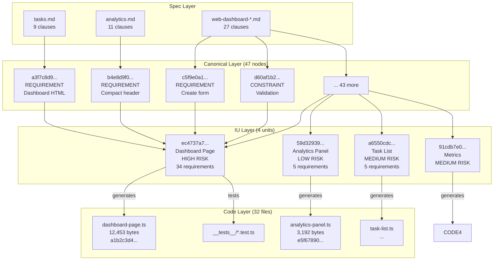

# Provenance Graph Visualization

## Mermaid Diagram



## Simplified: The Core Chain

```
spec/tasks.md ─┐
spec/analytics.md ─┼──[EXTRACT]──► canonical.json ──[PLAN]──► ius.json ──[GENERATE]──► src/generated/*.ts
web-dashboard-*.md ─┘              (47 nodes)          (4 IUs)                (32 files)
     │                                   │                │                      │
     │                                   │                │                      │
  text                              SHA-256            SHA-256               SHA-256
     │                              content            content               content
     │                              address            address               address
     │                                   │                │                      │
     └───────────────────────────────────┴────────────────┴──────────────────────┘
                              PROVENANCE GRAPH
                   (all transformations content-addressed)
```

## Traceability Example

Given a line of code in `dashboard-page.ts`:

**Question:** Where did this requirement come from?

**Trace:**
```
1. Code file: dashboard-page.ts
   └── Contains: export const _phoenix = { iu_id: "ec4737a7..." }

2. Look up IU: ec4737a7671a24d2c859604470556a65e34e7a700615fa11f18bf5e3d4e5ea88
   └── Found in: ius.json
   └── Contains: source_canon_ids: ["a3f7c8d9...", "b4e8d9f0...", ...]

3. Look up first canon_id: a3f7c8d9e1b2
   └── Found in: canonical.json
   └── Contains: {
         "text": "The dashboard must render a complete HTML page...",
         "source_file": "spec/web-dashboard-base.md",
         "section": "Dashboard Page",
         "confidence": 0.95
       }

RESULT: This code came from web-dashboard-base.md, Dashboard Page section,
        requirement about rendering complete HTML page.
```

## Content-Addressing In Action

If you change the spec:
```
spec/web-dashboard-base.md
  "The dashboard must render HTML"
      ↓ [EDIT]
  "The dashboard must render complete HTML5 with semantic markup"
      ↓ [RE-INGEST]
  canon_id changes: a3f7c8d9e1b2 → z9y8x7w6v5u4
      ↓ [RE-CANONICALIZE]
  IU's iu_id changes (derived from canon_ids)
      ↓ [SELECTIVE INVALIDATION]
  Dashboard Page IU marked for regeneration
      ↓ [RE-GENERATE]
  dashboard-page.ts updated
      ↓ [DRIFT CHECK]
  New hash recorded in manifest
```

**Key:** Only the affected IU regenerates, not the entire codebase.

## Graph Statistics

| Layer | Count | Content-Addressed |
|-------|-------|-------------------|
| Spec files | 9 | No (source) |
| Clauses | 47 | Yes (SHA-256) |
| Canonical nodes | 47 | Yes (SHA-256) |
| IUs | 4 | Yes (SHA-256) |
| Generated files | 32 | Yes (SHA-256) |
| **Total edges** | **79** | **All typed** |

## Edge Types

| From | To | Edge Type | Meaning |
|------|-----|-----------|---------|
| Spec | Canonical | `extracted_from` | Clause parsed from document |
| Canonical | IU | `requirements_of` | IU implements requirement |
| IU | Code | `generates` | Code produced from IU |
| IU | Test | `tested_by` | Test validates IU |
| Evidence | IU | `validates` | Policy decision |
