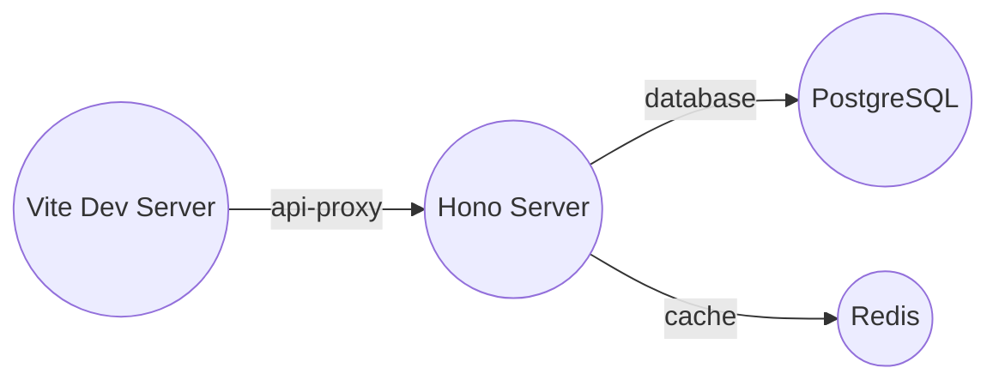

# Tensor Network Module Composition

## Core Concept

Use **Kitty's DisCoCat categorical grammar** to model modules as a **tensor network**:

```
Natural Language → CCG Parse → Pregroup Types → String Diagram → Tensor Network → Deployment
```

## The Tensor Model

### Types as Capability Interfaces

| Pregroup | Module Concept | Example |
|----------|---------------|---------|
| `n` | Capability type | `Database`, `HttpServer` |
| `n.r` | Right adjoint (need) | `Database.r` = "needs Database" |
| `n.l` | Left adjoint | `Database.l` = "provides Database" |
| `I` | Unit (no capability) | Empty module |

### Boxes as Modules

A module is a box with:
- **Domain** (bottom wires): What it needs (left adjoints)
- **Codomain** (top wires): What it provides (atomic types)

```
                    ┌─────────┐
   Database        │         │        HttpServer
      ↑            │  hono   │            ↑
      │            │ server  │            │
      └────────────┤         ├────────────┘
        Database.r │         │ HttpServer
                   └─────────┘
```

### Cups as Fulfillments

When a provider's output connects to a consumer's input:

```
    Provider.Database         Consumer.Database.r
           │                         │
           └──────────┬──────────────┘
                      │
                      ▼
                  ┌───────┐
                  │  Cup  │  ← Contract (eliminate pair)
                  └───────┘
                      │
                      ▼
                      I  (type eliminated)
```

In tensor notation: `provider.cod.r ⊗ consumer.dom.l → I`

## Example: Elena Dashboard

### Natural Language Spec

```markdown
# Elena Dashboard

A fullstack application using:
- Hono HTTP server with logging middleware
- PostgreSQL database for persistence
- Redis cache for performance
- Vite development server
- ElenaJS web components
```

### CCG Parse Tree

```
S
├── NP (Elena Dashboard)
│   └── N (Dashboard)
└── VP (using ...)
    ├── NP (Hono HTTP server with logging)
    │   ├── N (Hono)
    │   ├── N (server)
    │   └── PP (with logging)
    │       └── NP (logging)
    │           └── N (logging)
    └── ... (more modules)
```

### Pregroup Types

```
hono-server:          I → HttpServer ⊗ Logging.l ⊗ Database.l
hono-logger:          I → Logging
postgres:             I → Database
redis:                I → Cache
vite-dev-server:      I → DevServer
elenajs-core:         I → ComponentFramework
```

### Tensor Network (Before Contraction)

```
  HttpServer  Logging  Database  Cache  DevServer  ComponentFramework
      ↑          ↑       ↑       ↑        ↑            ↑
      │          │       │       │        │            │
   ┌──┴──────────┴──┬────┴──┬────┴──┬─────┴──┬─────────┴──┐
   │                │       │       │        │            │
   │  hono-server ⊗ hono-logger ⊗ postgres ⊗ redis ⊗ vite ⊗ elenajs
   │                │       │       │        │            │
   └──┬──────────────┴──┬────┴──┬────┴──┬─────┴──┬─────────┘
      │                 │       │       │        │
  Logging.l         Logging Database  ...    ...
  Database.l
```

### Tensor Network (After Contraction)

```
  HttpServer  DevServer  ComponentFramework  Cache
      ↑          ↑            ↑              ↑
      │          │            │              │
   ┌──┴──────────┴────────────┴──────────────┴──┐
   │                                              │
   │  [hono-server ⊗ hono-logger ⊗ postgres ⊗ ...]  │
   │                                              │
   │     (cups contracted all internal wires)       │
   │                                              │
   └──────────────────────────────────────────────┘
```

## Implementation

### Rust Code

```rust
use phoenix_vcs::kitty::module_bridge::{KittyModuleParser, generate_from_spec};
use phoenix_vcs::kitty::module_tensor_network::ModuleTensorNetwork;

// Parse natural language spec
let spec = r#"
# Elena Dashboard

Uses Hono server with Postgres database and Redis cache.
"#;

let parsed = KittyModuleParser::parse(spec)?;
let network = KittyModuleParser::to_tensor_network(&parsed);

// Visualize as Mermaid diagram
println!("{}", network.to_mermaid());

// Contract to find connected components
let contracted = network.contract()?;
println!("Found {} connected components", contracted.components.len());

// Generate deployment
let deployment = generate_from_spec(spec)?;
```

### Output

**Mermaid Diagram:**


**Contracted Network:**
```
Connected Components: 1
  [hono-server, postgres, redis, vite]

Free Interfaces (exposed to outside):
  - hono-server: HttpServer (http://localhost:3000)
  - vite: DevServer (http://localhost:5173)
```

## Grammatical Patterns

### 1. "X with Y" → X needs Y

```
"Hono server with logging"

CCG:  NP (Hono server) ⊗ NP (logging)
      └─ PP (with) ──┘

Pregroup: 
  hono-server: I → HttpServer ⊗ Logging.l
  hono-logger: I → Logging
  
Result: Cup connects hono-server.Logging.l ⊗ hono-logger.Logging.r → I
```

### 2. "X connects to Y" → X uses Y

```
"Frontend connects to API"

CCG:  NP (Frontend) ── VP ── PP (to API)
                  connects  └── NP (API)

Pregroup:
  frontend: I → WebComponents ⊗ HttpClient.l
  hono-server: I → HttpServer
  
Result: frontend.HttpClient.l ↔ hono-server.HttpServer (via API)
```

### 3. "X via Y" → X proxied through Y

```
"App via Nginx to backend"

Pregroup: app.cod ⊗ nginx.dom → nginx.cod ⊗ backend.dom
```

### 4. "X for Y" → X provides to Y

```
"Redis for caching"

Pregroup: redis: I → Cache (for whoever needs it)
```

## Functor Laws

The module network preserves structure through composition:

### Identity

```
Module with no needs + no provides = I (identity wire)
```

### Associativity

```
(A ⊗ B) ⊗ C = A ⊗ (B ⊗ C)

Modules compose in any order; result is same tensor network.
```

### Tensor Product

```
Parallel composition: A ⊗ B

Both modules run independently, no connections between them.
```

### Sequential Composition

```
Sequential composition: B ∘ A (via cup)

A's output connects to B's input.
```

## Constraint-Based Selection

The tensor network can include "weighted" types for constraint resolution:

```rust
// Type with properties (like a vector space with basis)
Database {
    type: "sql",
    persistence: "durable",
    cost: 0.05,
    max_connections: 100,
}

// Need with constraints (tensor with linear constraints)
Need {
    interface: Database,
    constraints: [
        PropertyEquals("persistence", "durable"),
        MaxCost(0.10),
    ]
}
```

In tensor terms, this is like:
- Provider: Vector `|provider⟩` in capability space
- Need: Dual vector `⟨need|` 
- Fulfillment: `⟨need|provider⟩` = inner product (constraint satisfaction score)

## Deployment Generation

The contracted tensor network maps directly to deployment:

```
Connected Component 1:
  [hono-server, postgres, redis, vite]
  
  → Docker Compose service group
  → Kubernetes pod with 4 containers
  → Nix flake with 4 services
  
Free Interface: HttpServer@hono-server:3000
  → Exposed port 3000
  → Load balancer target
  → Health check endpoint
```

## Comparison to Bundle System

| Aspect | Bundle | Tensor Network |
|--------|--------|----------------|
| **Structure** | Fixed template | Flexible graph |
| **Dependencies** | Implicit | Explicit (wires) |
| **Validation** | String matching | Type checking |
| **Swapping** | Fork bundle | Rewire tensor |
| **Optimization** | None | Tensor contraction |
| **Source** | Natural language | Natural language + CCG |
| **Semantics** | None | Compositional (DisCoCat) |

## Future Work

1. **Neural CCG Parser**: Train on tech specs to improve parsing
2. **Probabilistic Types**: Weighted tensor networks for fuzzy matching
3. **Quantum-inspired**: Use density matrices for uncertain providers
4. **Automatic Differentiation**: Optimize deployment cost via gradient descent on tensor weights
5. **Category Theory Proofs**: Verify system properties (safety, liveness) via diagram rewriting

## References

- **DisCoCat**: Coecke et al., "Mathematical Foundations for a Compositional Distributional Model of Meaning"
- **Lambeq**: Kartsaklis et al., "lambeq: An Efficient High-Level Python Library for Quantum NLP"
- **String Diagrams**: Selinger, "A Survey of Graphical Languages for Monoidal Categories"
- **Tensor Networks**: Biamonte & Bergholm, "Tensor Networks in a Nutshell"

## Summary

```
┌─────────────────────────────────────────────────────────────────┐
│           MODULE AS TENSOR NETWORK                               │
├─────────────────────────────────────────────────────────────────┤
│                                                                  │
│   Natural Language                                               │
│        │                                                         │
│        ▼                                                         │
│   ┌─────────┐                                                    │
│   │  CCG    │  ← Combinatory Categorial Grammar                 │
│   │  Parse  │                                                    │
│   └────┬────┘                                                    │
│        │                                                         │
│        ▼                                                         │
│   ┌─────────┐                                                    │
│   │Pregroup │  ← Free pregroup (n, n.r, n.l)                     │
│   │  Types  │                                                    │
│   └────┬────┘                                                    │
│        │                                                         │
│        ▼                                                         │
│   ┌─────────┐                                                    │
│   │ String  │  ← Boxes, cups, caps                             │
│   │ Diagram │                                                    │
│   └────┬────┘                                                    │
│        │                                                         │
│        ▼                                                         │
│   ┌─────────┐                                                    │
│   │ Tensor  │  ← Contract indices, find components             │
│   │Contract │                                                    │
│   └────┬────┘                                                    │
│        │                                                         │
│        ▼                                                         │
│   ┌─────────┐                                                    │
│   │ Deploy  │  ← Docker, K8s, Nix                               │
│   └─────────┘                                                    │
│                                                                  │
└─────────────────────────────────────────────────────────────────┘
```

**Mathematics enables flexible, verifiable, optimizable module composition.**
